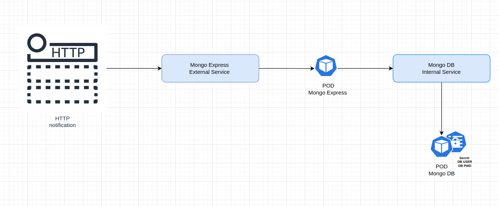

# k82-mongo-express 

## Architecture. 




<br />
<br />


# Create the secret service first. 


```hell
    $ kubectl apply -f secret.yaml
```


# Create the configMap service. 


```hell
    $ kubectl apply -f configMap.yaml
```


# Create the deployment for the mongoDB

```shell
    $ kubectl apply -f mongo.yaml
```


# Create the deployment for the mongo-express

```shell
    $ kibectl apply -f mongo-express.yaml
```

# start the EXTERNAL service from mongo-express
```shell 
    $ minikube service <serviceName>
```


